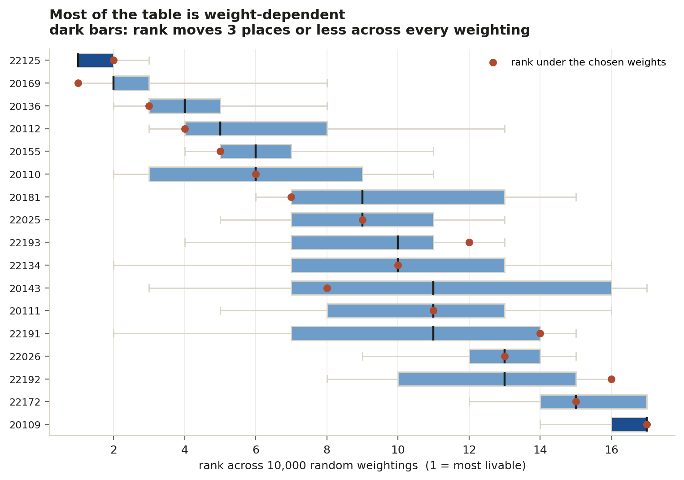
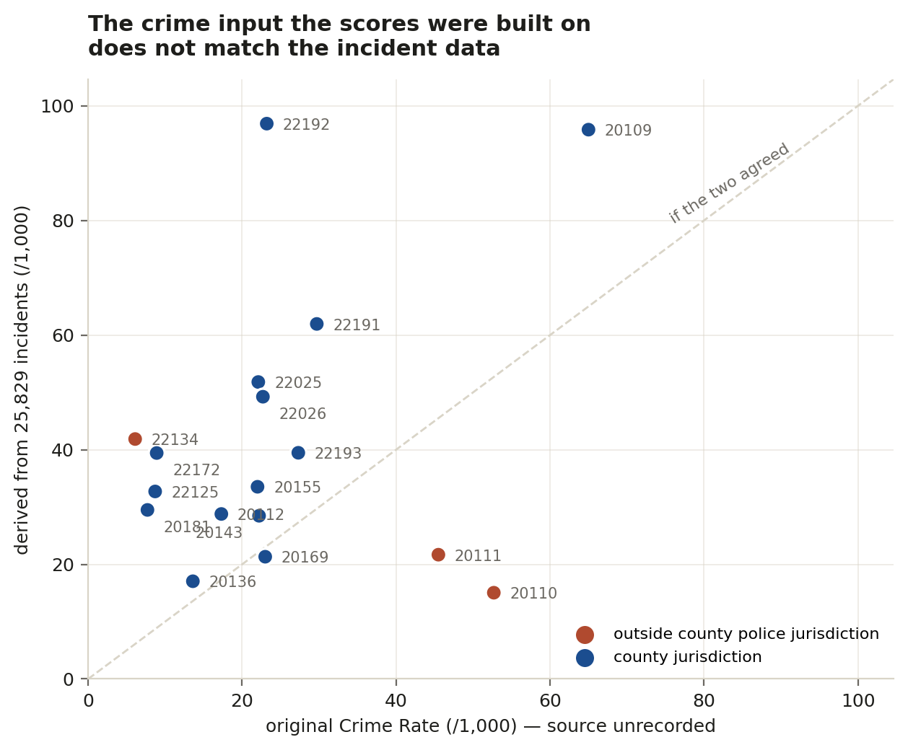
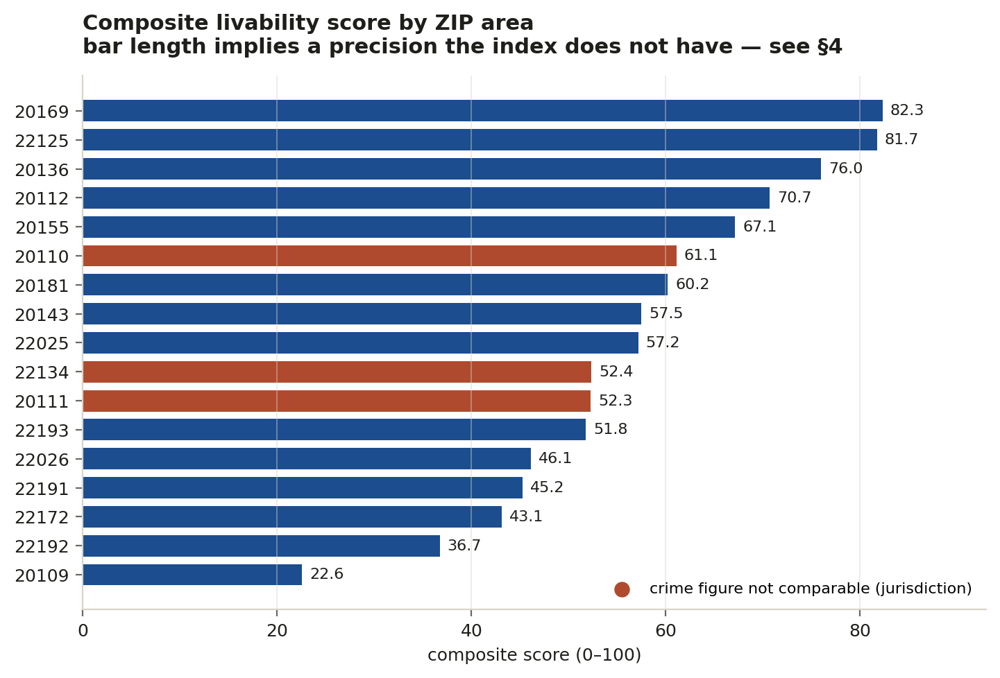
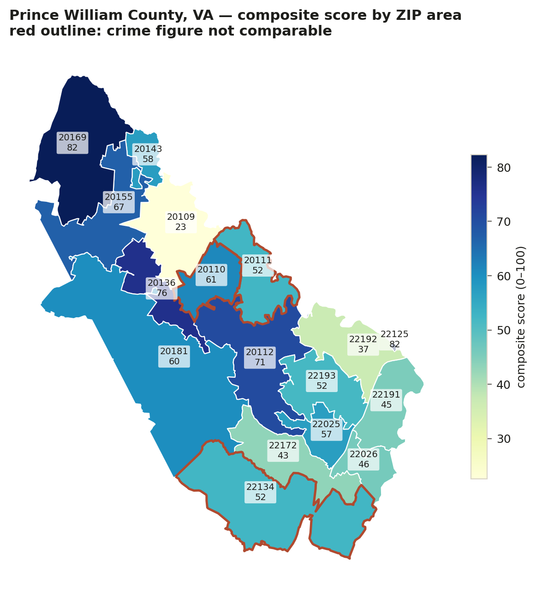

# CityScore — a livability index, and how much of it is real

> A 0–100 composite score for 17 ZIP areas in Prince William County, Virginia,
> built from six indicators — and a measurement of how much the resulting ranking
> depends on the two choices that produced it.

**🌐 [Interactive report](docs/index.html)** — move the six weights and watch the ranking
come apart. Self-contained single page; deploys from `docs/`.

`Python` · `pandas` · `GeoPandas` · `matplotlib` · composite indexing · geospatial · sensitivity analysis

**Che-Wei Lee** — M.S. in Data Analytics Engineering, Northeastern University

---

## The finding

Composite indices produce a ranked table, and a ranked table looks like a result.
This one mostly is not.

Across **10,000 random weightings** — every way of splitting 100% across the six
indicators, sampled uniformly — the median ZIP area moves **8 places out of 17**.
Only **2 of the 17** hold their position within three places no matter how the
index is weighted. Change nothing but the *direction* of the two arguable
indicators and ranks shift by up to **5 places**.

So the honest output is not a league table. It is:

- **Occoquan (22125) is top-5 under 99.9% of all possible weightings.**
- **Manassas/Sudley (20109) and Triangle (22172) are bottom-5 under >90% of them.**
- Everything between those is a restatement of the weights that produced it.

That is a smaller claim than "17 areas ranked 22.6 to 82.3", and it is the one the
data supports.



---

## The crime input had to be rebuilt from source

Crime carries the largest weight in the composite (0.30), so it got checked first.
The project originally scored it from `Crime Reports.csv`, a 16,000-row export.
Three things about that file, in the order they turned up:

1. It contains **exactly 16,000 rows**.
2. The county's ArcGIS feature service declares **`maxRecordCount: 16000`** — one
   request cannot return more.
3. That service reports **23,914 incidents inside the same date window** the export
   covers.

The export held about **two thirds of its own window** and stopped where the API
stopped, not where the data did. There is no reason the missing third is spread
evenly across ZIP codes, so a rate computed from it is not a rate.

[`build_data.py`](build_data.py) pages past the cap and pulls all **25,829**
incidents reported in calendar 2025, then assigns each to a ZIP area by
point-in-polygon against Census ZCTA boundaries. (The service publishes a
`ZipCode` field; it is null on every public record.)

The rebuilt rate and the original column are **close to unrelated — Spearman
+0.115**:



> The provenance of the original `Crime Rate(/1,000)` column is not recorded, so
> which of the two is "right" cannot be settled here. The derived one is used
> because it is the one this repository can reproduce.

### Three areas whose crime figure is not comparable

This is the **county** police department's records system:

| ZIP | Why the count is not a safety measurement |
|---|---|
| 20110 | City of Manassas — independent city, its own police department |
| 22134 | MCB Quantico — military installation, federal policing |
| 20111 | Partly Manassas Park, also independently policed |

A low count there measures who files the paperwork. They are flagged in every
table and figure rather than quietly ranked. The publisher also excludes sexual
offences for victim privacy, which makes this an undercount of violent crime
everywhere.

---

## Method, and the choices inside it

1. **Six indicators per ZIP** — crime rate, median income, share with a bachelor's
   degree or higher, median house price, unemployment, population density.
2. **Min–max normalisation to 0–1.** Worth being explicit: with **n = 17**, the
   best and worst area are pinned to exactly 1.0 and 0.0 on every indicator *by
   construction*. Part of the spread in the final score is the scaling, not the
   county.
3. **Direction.** Crime and unemployment are obviously "lower is better". Two are
   not:
   - **Housing** is treated as *affordability* — cheaper scores higher. The
     original code did the opposite while its own chart was titled *"Housing
     Affordability Score (Higher = Cheaper)"*; the label and the arithmetic
     disagreed. Inverting also stops it double-counting income.
   - **Density** is left as *denser scores higher* — closer to jobs and amenities
     in a commuter county. The opposite reading is just as defensible.

   Both are tested rather than asserted; §5 of the notebook re-ranks under all four
   combinations.
4. **Weights** — 0.30 crime, 0.20 income, 0.20 education, 0.10 each for housing,
   unemployment and density. A judgement, not a result, which is why the whole
   sensitivity analysis exists.





---

## Running it

```bash
pip install pandas geopandas matplotlib jupyter
python build_data.py          # refreshes data/ from the county API + Census (~2 min)
jupyter lab cityscore_analysis.ipynb
```

`build_data.py` hits the network. The notebook does not — it reads only from
`data/`, which is committed, so it runs top to bottom on a fresh clone.

```
cityscore-livability-index/
├── build_data.py                     ← fetch boundaries + incidents, derive the indicators
├── cityscore_analysis.ipynb          ← the analysis, narrated, runs top to bottom
├── data/
│   ├── indicators.csv                ← six indicators per ZIP, crime derived here
│   ├── crime_incidents_2025.csv      ← 25,829 incidents, complete for calendar 2025
│   └── zcta_boundaries.geojson       ← the 17 ZIP areas (Census cartographic boundaries)
├── outputs/
│   ├── zip_scores.csv                ← final scores + six components
│   ├── crime_rate_comparison.csv     ← derived vs original crime rate
│   ├── weight_sensitivity.csv        ← rank distribution over 10,000 weightings
│   └── summary.json
├── docs/index.html                   ← the interactive report (GitHub Pages)
├── images/                           ← figures, exported by the notebook
├── archive/                          ← the original inputs, kept for provenance
└── CityScore_Report.pdf              ← the original written report (pre-rebuild)
```

---

## Limitations

- **The ranking is weight-dependent** and the notebook says so quantitatively
  rather than in a caveat sentence. Only the top and bottom of the table survive.
- **Crime is measured for one year (2025) by one department.** Three areas are
  outside its jurisdiction; sexual offences are excluded everywhere.
- **Two areas are too small to rate.** Occoquan (917 residents) and Catharpin
  (1,124) produce rates from a few dozen incidents; their Poisson intervals span
  most of the table.
- **ZCTA ≠ ZIP.** The Postal Service publishes no boundaries; ZCTAs are the Census
  Bureau's areal approximation, which is why this says "ZIP areas".
- **Income, education, housing and unemployment are a snapshot** carried over from
  the original collection and not re-sourced here.
- **`CityScore_Report.pdf` predates the crime rebuild**, so its rankings are the
  old ones. Kept as a record of the first pass.

## Sources

- Crime incidents — Prince William County, [Public Crime Data](https://experience.arcgis.com/experience/cdb0743527c448b2a2ea18124e670779)
  (ArcGIS feature service, records-management system, updated daily)
- ZIP boundaries — U.S. Census Bureau, [2020 cartographic boundary file, ZCTA5](https://www2.census.gov/geo/tiger/GENZ2020/shp/)
