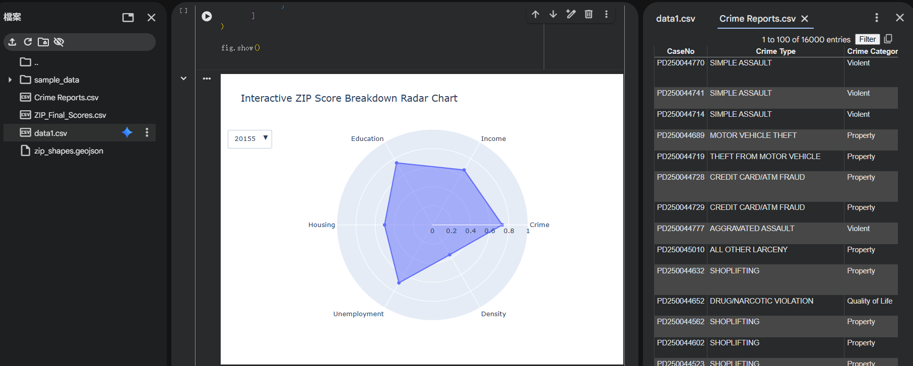
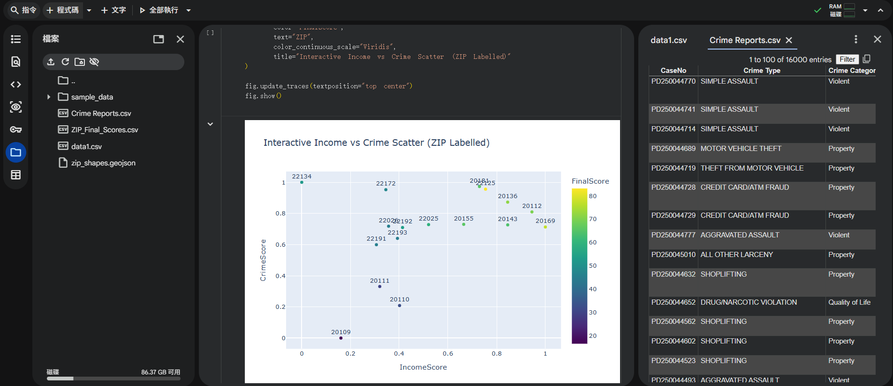
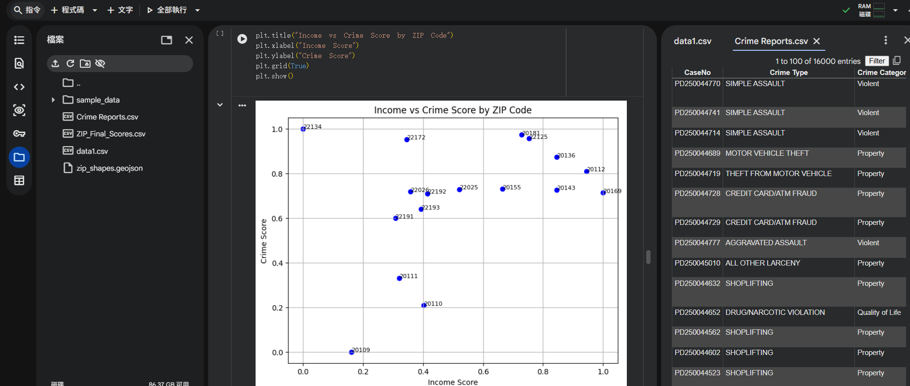
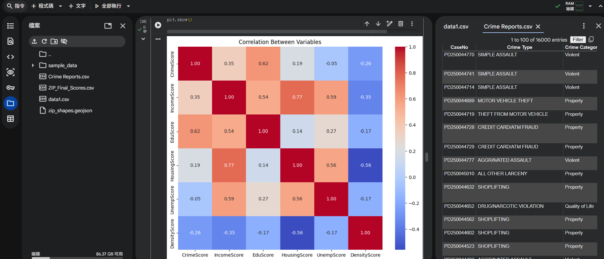

# City Score Analytics — Regional Livability Index

**A 0–100 livability index that ranks neighborhoods using six social and economic factors.**

> Author: Che-Wei Lee · MS in Data Analytics Engineering, Northeastern University

This project builds a composite **livability index** for 17 ZIP-code areas by combining six normalized social and economic indicators into a single 0–100 score. It integrates 16,000+ records on crime, income, education, housing, employment, and population density, then ranks and maps the results to reveal where livability is highest — and where the gaps are.

**Headline:** scores ranged from **16.6 to 83.2**, with ZIP **22125 (83.2)** at the top, followed by **20169 (77.2)** and **20136 (71.7)** — clear, defensible separation between the most and least livable areas.

---

## Method

1. **Collect** six indicators per ZIP: crime (from 16,000+ incident records), median income, education level (bachelor's+), housing prices, unemployment, and population density.
2. **Normalize** each indicator to a 0–1 scale (higher = more livable; crime, unemployment, and density inverted where appropriate).
3. **Weight & combine** the six normalized indicators into a single **0–100 composite score**.
4. **Rank & map** the ZIP areas to surface livability gaps across the region.

The six component scores per ZIP are stored in `ZIP_Final_Scores.csv` (`CrimeScore`, `IncomeScore`, `EduScore`, `HousingScore`, `UnempScore`, `DensityScore`) alongside the final `FinalScore`.

---

## Selected Visualizations

| | |
|---|---|
|  |  |
|  |  |

Full write-up and methodology: **[`CityScore_Report.pdf`](CityScore_Report.pdf)**.

---

## Repository Structure

```
cityscore-livability-index/
├── README.md                  ← this file
├── cityscore_analysis.ipynb   ← analysis notebook (normalize → score → rank → visualize)
├── CityScore_Report.pdf       ← full written report
├── images/                    ← exported figures
├── Crime Reports.csv          ← raw crime incident records (16K+)
├── data1.csv                  ← raw socioeconomic indicators per ZIP (income, population, density, education, housing)
├── data.xlsx                  ← indicators in Excel form
├── data.csv                   ← final 0–100 scores + 6 component scores (the notebook's input table)
└── ZIP_Final_Scores.csv       ← final scores (same table, labeled output)
```

---

## How to Run

**Requirements:** Python 3.x with `pandas` (plus `matplotlib` / `plotly` / `geopandas` for the visuals).

```bash
pip install pandas matplotlib plotly geopandas
```

Open `cityscore_analysis.ipynb` and run top-to-bottom. It reads `data.csv` and `ZIP_Final_Scores.csv` from the project root.

---

## Limitations

- **Snapshot in time** — indicators reflect the period of data collection.
- **Indicator weighting is a modeling choice** — the composite reflects the chosen weights; different weights would reorder the middle of the ranking.
- **Geographic scope** — 17 ZIP areas; not a full metropolitan census.

---

## Tools

| Stage | Tools |
|---|---|
| Processing | Python, pandas |
| Visualization | Matplotlib / Plotly / GeoPandas |
| Reporting | Written PDF report |
